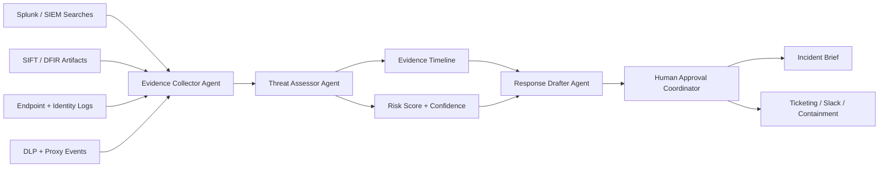

# Architecture

EvidenceOps Agent is currently a static prototype with mock telemetry. The architecture is designed so the mock inputs can be replaced by Splunk searches, SIFT artifact parsers, MCP tools, or endpoint triage sources.

## Components

### Evidence Collector Agent

Normalizes alerts and events into a shared timeline. In the prototype, this is represented by scenario data in `app.js`. In a Splunk build, this component would call saved searches or Splunk MCP tools.

### Threat Assessor Agent

Scores the incident and explains which evidence supports each conclusion. The current prototype uses transparent deterministic rules so judges can inspect the behavior without credentials.

### Response Drafter Agent

Creates the incident report with what happened, evidence, recommended response steps, and approval gates.

### Human Approval Coordinator

Separates high-impact response actions from fully automated analysis. This is the trust boundary: the agent can recommend token revocation, account suspension, write freezes, or legal hold creation, but a human must approve.

## Security Boundaries

- The prototype does not execute destructive actions.
- Response actions are represented as approval items.
- Future integrations should expose typed tools rather than arbitrary shell commands.
- Original evidence should remain read-only.
- Every finding should link back to timeline evidence and execution logs.

## Data Flow

1. Alerts enter from telemetry sources.
2. Evidence Collector normalizes them into timeline events.
3. Threat Assessor maps the timeline to incident patterns.
4. Response Drafter writes the report.
5. Approval Coordinator queues risky actions for human review.
