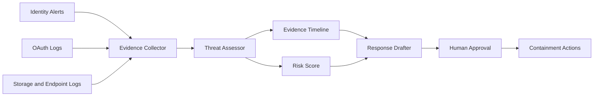

# EvidenceOps Agent Submission Pack

## Project Title

EvidenceOps Agent

## One-Liner

An explainable AI incident response workspace that turns noisy security alerts into an evidence-linked response plan.

## Short Description

EvidenceOps Agent helps responders triage identity, OAuth, endpoint, storage, DLP, proxy, backup, and developer alerts in one place. It correlates suspicious sequences, assigns a risk score, cites the supporting evidence, and drafts a response packet that a human can approve before disruptive actions are taken.

## Problem

Security teams often receive fragmented alerts from identity providers, cloud storage, endpoint tools, and SIEM dashboards. The hardest part is not seeing one alert; it is reconstructing the story quickly enough to decide whether the event is compromise, what evidence supports the conclusion, and what response steps are justified.

## Solution

EvidenceOps Agent presents an incident workspace with three layers:

1. Alert feed: raw signals from security systems.
2. Evidence timeline: ordered events that explain the attack path.
3. Agent reasoning: rule and agent-derived conclusions with confidence and next actions.

The demo includes three replayable scenarios: OAuth token theft, ransomware prelude, and insider exfiltration.

## Built With

- HTML
- CSS
- JavaScript
- Mock SIEM/security telemetry

## What Makes It Useful

- Explains the reason behind a risk score.
- Preserves evidence references for auditability.
- Produces a concise response brief for analysts and leadership.
- Keeps a human approval checkpoint before disruptive actions such as session revocation.
- Supports multiple incident scenarios for a stronger judging demo.
- Can be extended to Splunk searches, MCP tools, ticketing, and Slack/Jira workflows.

## Prize Track Positioning

### FIND EVIL!

Position EvidenceOps Agent as an automated incident response and forensic reasoning system. Emphasize the evidence timeline, suspicious OAuth token replay, and recommended containment actions.

### Splunk Agentic Ops Hackathon

Position the product as an agentic SecOps workspace for Splunk. Replace the mock alert data with SPL search results and use the current UI as the analyst cockpit.

### Band of Agents

Describe the workflow as three agents:

- Evidence Collector: gathers alerts and log events.
- Threat Assessor: scores the incident and maps the attack sequence.
- Response Drafter: writes a human-approved response brief.

## Demo Video Script

Hello, this is EvidenceOps Agent, an AI incident response workspace for noisy security operations.

In this scenario, the security team has alerts from identity, OAuth, endpoint, and cloud storage systems. Individually, each alert is easy to miss. Together, they tell a critical story.

First, I choose a scenario. The demo supports OAuth token theft, ransomware prelude, and insider exfiltration. The agent loads the alert feed and builds an evidence timeline from the relevant signals.

Now I click Run Agent. The workspace generates a risk score, a confidence level, and three evidence-backed conclusions.

The bottom panel drafts an incident brief with recommended response steps, while the right panel creates a human approval queue for high-impact actions such as revoking tokens, disabling accounts, freezing writes, or opening a legal hold ticket.

The key idea is explainability and control. The agent does not just say "critical"; it shows why, cites the evidence, and prepares a response that a human can approve.

Future integrations would connect this UI to Splunk searches, MCP tools, Jira, Slack, and automated containment playbooks.

## Judge-Friendly Architecture

## Submission Checklist

- Project name: EvidenceOps Agent
- Short description: use the one-liner above.
- Demo URL: local today; deploy to Netlify/Vercel/GitHub Pages before final submission.
- Code URL: create a GitHub repo from this folder.
- Video: record 2-3 minutes using the demo script.
- Screenshots: capture the full dashboard after choosing a scenario and clicking Run Agent.
- Tracks: security, AI agents, observability, incident response.

## Next Build Steps

1. Add a Splunk connector mock that accepts SPL-like saved searches.
2. Add a downloadable Markdown incident report.
3. Add selectable scenarios for ransomware, OAuth token theft, and insider exfiltration.
4. Add a human approval modal for token revocation and ticket creation.
