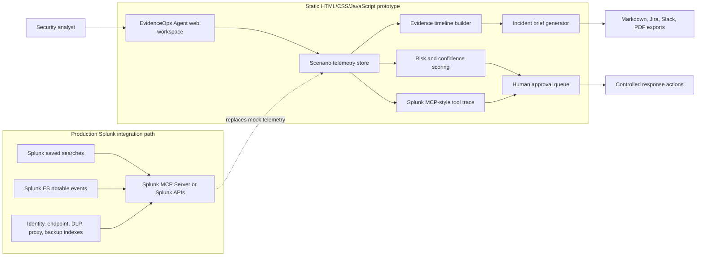

# EvidenceOps Agent Architecture Diagram

The submitted demo uses deterministic mock telemetry so judges can replay each incident scenario without credentials. In production, the scenario telemetry store would be replaced by Splunk saved searches, Splunk MCP Server calls, Splunk Enterprise Security notable events, or Splunk API responses. Splunk remains the system of record for operational data, while EvidenceOps Agent provides explainable investigation, risk scoring, approval gates, and report generation.
